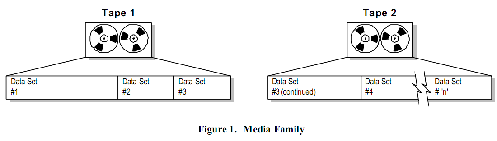

# 数据集（Data Set）

当一组 objects 通过数据管理操作（备份，传输或者复制）写到可移动存储媒介（磁带、光盘等）的过程中。
它会以 _数据集_ 的形式保存。
一个媒介可以包含多个数据集而一个数据集也可能跨越不同的媒介。
下图使用磁带作为媒介类型。
术语 _媒体簇_ 指的是一组附加在一起并且跨越一个或者多个独立磁带或者媒介的数据集。
下图是数据集如何放在一个或者多个媒介的简单示例。

