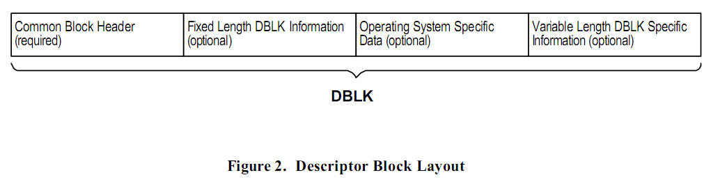
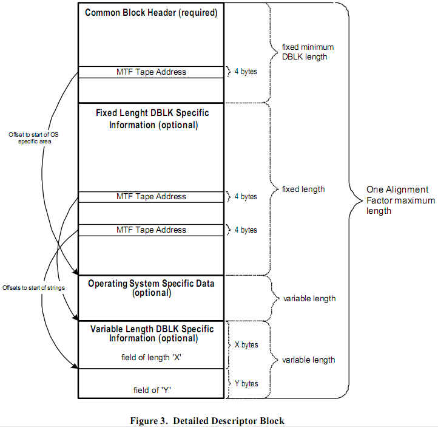
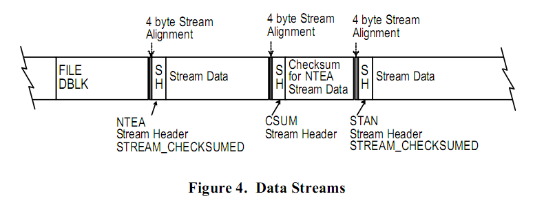

# 基础元素

MTF 的基础元素有 _描述块_，_数据流_，和 _卷标_。
描述块用于格式控制，数据流用于和关联的描述块提供数据封装和对齐，卷标用于逻辑隔离和在媒介之内快速定位。

## 描述块

描述块是建立起 MTF 格式的主要构件块。
在接下来的文档中描述块等同于 DBLK。
MTF定义了适合相应角色的 DBLKs。

### 描述块剖析

一个 DBLK 本质上就是一个由四部分组成的变长的块。
第一部分是所有 DBLKs 都有的定长的公共的块头。
第二部分是一个根据 DBLK 类型的不同而有所变化的定长信息。
第三部分是一个根据 DBLK 的类型和操作系统的不同而有所不同的系统相关数据。
第四部分是变长的部分用于存储第二部分不够空间存储的信息。
在这四个部分中只有第一部分是必须的。

#### 公共的块头

公共的块头用于在每个 DBLK 的开头包含 DBLK 的常规信息。
公共的块头包含一个指向操作系统相关的数据片的指针。
关于公共的块头的详细描述，请查看 ***描述块*** 章节。

#### 定长的 DBLK 信息

定长的 DBLK 信息跟在公共的块头后面并且包含特定于 DBLK 类型的定义信息。
对于每个 DBLK 类型来说这一部分的长度是固定的并且有可能包含一个指向   _变长的 DBLK 相关信息_ 部分的指针。
这部分是可选的，并且如果这种类型的 DBLK 没有相关的信息的话这部分会省略。
详情请查看 ***描述块*** 章节。

#### 操作系统相关数据

操作系统相关数据是包含特定与 DBLK 的类型和操作系统的变长信息，这部分是可选的。
详情请查看 ***描述块*** 章节。

#### 变长的 DBLK 相关信息

变长的 DBLK 相关信息含有特定于 DBLK 的类型的变长信息。
存储的变长信息由 _定长的 DBLK 信息_ 指定位置。

#### 描述块的层次详情

下图显示了一个常见的 _描述块_ 的层次详情。
在 _公共的块头_ 中有一个 _MTF Tape Address_ 子结构指定 _操作系统相关数据_ 的位置。
类似地 _定长的 DBLK 信息_ 中有一个 _MTF Tape Address_ 子结构指定  _变长的 DBLK 相关信息_ 的位置。

### 定义描述块

MTF 定义了多种用于数据管理操作的 _描述块_。
下面是当前 MTF 定义的 DBLKs 的概述。
当有新的需求时新的 DBLKs 会由 MTF Review Committee 定义。

#### 磁带头描述块

磁带头描述块（MTF_TAPE_DBLK）会出现在每个媒介的开头。
MTF\_TAPE\_DBLK 描述了媒介的信息。
这些信息包括指定这个媒介所属的 _媒体簇_ 的唯一标识，
这个媒介在 _媒体簇_ 中的顺序，以及一个用于标识用户的字符串名称，以及其他需要说明的信息。
信息存在的地方以及 **基于媒介的 Catalog** 的类型。

> 注意：即使这个 DBLK 的名字是磁带头描述块，它可用于磁带，光盘，以及其他的可移动存储设备。

#### 数据集起始描述块

_数据集起始描述块_ 出现在每个数据集的开头。
它包含了一些描述数据集的信息，比如：名称，用户描述，密码，顺序号，写到媒介的时间和日期，用于创建数据集的数据管理操作（transfer，copy，normal backup，differential backup等）的类型。

#### 卷描述块

_卷描述块_ (MTF\_VOLB\_BLOCK）描述了一个要写到媒介的卷（volume）。
这包括设备名称，卷名称，机器名称以及写到媒介的日期。

#### 目录描述块

_目录描述块_（MTF\_DIRB\_DBLK）描述了一个要写到媒介的目录的全路径。
这包括目录的名称，目录创建的时间，最后修改时间，备份的时间，上一次访问的时间和目录的属性等（比如：只读）。

#### 文件描述块

_文件描述块_（MTF\_FILE\_DBLK）描述了将要写到媒介的文件的信息并且接下来的是文件的数据。
MTF\_FILE\_DBLK 包含的信息有：文件名，文件大小，文件的创建时间，最后访问时间和最后修改时间和文件的属性（比如：只读，隐藏，系统文件 等）

#### 损坏对象描述块

经常出现这么一种情况：当 DBLK 已经写入媒介后，发现并不是所有相关的数据都可以读写（这通常是因为：磁盘损坏、网络失败等）。
当这种情况发生时，那部分不能读取的块需要被填充从而使流的大小正确。

_损坏对象描述块_（MTF\_CFIL\_DBLK）会接着写在后面指明前面 DBLK 关联的数据是损坏的。
MTF\_CFIL\_DBLK 包含指定流中损坏数据的大小以及开始的位置。

#### 填充结束描述块（End of Set Pad Descriptor Block）

_填充结束描述块_（MTF\_ESPB\_DBLK）只有当物理块的大小比 _逻辑块格式_ 的大小大的时候才使用。
MTF\_ESPB\_DBLK 是一种在数据集结束的时候用于填充到下个物理块的边界的可选方法。
另一种可选方法是最后一个 DBLK 关联的 SPAD 可以延伸到下一个物理块的边界。

> 注意：逻辑块格式在3.7节定义。

#### 数据集结束描述块

所有的数据集都以 _数据集结束描述块_（MTF\_ESET\_DBLK）。
因为不知道一个数据集中将有多少数据要写进去， MTF\_ESET\_DBLK 用于作为指示数据集结束的指示器。
它同时包含那些当数据管理操作结束时才有效的数据，比如有多少个损坏的对象写到媒介中。

#### 磁带标记结束描述块（End of Tape Marker Descriptor Block）

_磁带标记结束描述块_（MTF\_EOTM\_DBLK）是写到一个“完整”媒介的最后一个  DBLK。
和 MTF\_ESET 类似，MTF\_EOTM 主要作为指示器，但同时包含最后一个 基于媒介的 Catalogs 需要的信息。

#### 软卷标描述块

_软卷标描述块_（MTF\_SFMB\_DBLK）用于当硬件不支持文件标志的时候，模拟出文件标志。

## 数据流

_数据流_ 用于封装数据。
这个封装好的数据可以跟 _描述块_ 关联起来。
一个 _数据流_ 是由一个 _流的头_ 以及一个紧接着这个 _流的头_ 的 _流数据_ 组成。
_流的头_ 中的一个域定义了一个用于指定紧接着它的 _流数据_ 的类型。
对不同类型的 _流数据_ 进行隔离意味着隔离与平台相关的数据。
详情请查看 **数据流** 一章。

## 卷标（Filemarks）

_卷标_ 用于逻辑分隔以及在媒介中快速定位。
如果使用的设备不支持卷标，那么卷标必须由设备驱动或者 _软卷标描述块_ 来模拟。
_卷标_ 的位置将在下一节 **媒介布局** 中介绍。
