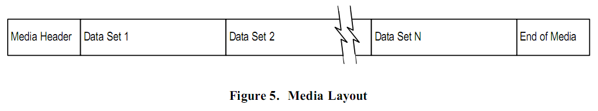

# 媒介布局

MTF 定义了媒介由一个媒介头（Media Header），一个或者多个数据集，以及媒介尾（End of Media）组成。
_媒介头_ 用于唯一标识媒介。
_数据集_ 用于存储一个数据管理操作中的一组描述块和数据流。
_媒介尾_ 用于从一个媒介跨越到下一个。

## 媒介头

_媒介头_ 主要用于唯一标识媒介。
一个 _媒介头_ 主要由 磁带头描述块（MTF\_TAPE\_DBLK），SPAD 数据流，和 卷标 组成。
SPAD 数据流 用于填充 MTF\_TAPE\_DBLK 和 _卷标_ 之间的间隙。

## 数据集

数据集是由 数据集起始描述块（MTF\_SSET\_DBLK），一系列用于数据管理操作的描述块，一个卷标，数据集结束描述块（MTF\_ESET\_DBLK），和 _卷标_ 组成。
通常来说，用于数据管理操作的 _描述块_ 包括：卷，目录和文件 _描述块_。
将有一个可选的基于媒介的 Catalog 数据流和数据集结束描述块关联。

### 数据集中的隐含优先级

理解 MTF 是线性格式以及使用隐含优先级去保存 _描述块_ 中的父子关系是非常重要的。
就是说， _描述块_ 的定义已经隐含了它们之间的父子关系并且当一个未知的 _描述块_ 出现时，将无法决定它们的父子关系。

<table>
  <caption>**表1. 数据集中的隐含优先级**</caption>
  <tr>
    <th></th><th>父</th><th>子</th>
  </tr>
  <tr>
    <th>MTF\_SSET</th><td></td><td>MTF\_VOLB</td>
  </tr>
  <tr>
    <th>MTF\_VOLB</th><td>MTF\_SSET</td><td>MTF\_DIRB</td>
  </tr>
  <tr>
    <th>MTF\_DIRB</th><td>MTF\_VOLB</td><td>MTF\_FILE</td>
  </tr>
  <tr>
    <th>MTF\_FILE</th><td></td><td></td>
  </tr>
</table>

比如说当一个 _卷描述块_ 写到数据集后，除非有另一个 _卷描述块_ 写到数据集，否则所有跟在它后面的目录和文件描述块都是它的儿子。
这对于 _目录描述块_ 来说同样适用。
当一个 _目录描述块_ 写到一个数据集后，除非有另外一个 _目录描述块_ 写进数据集否则所有跟着的 _文件描述块_ 都是它的儿子。

### 基于媒介的 Catalog

_基于媒介的 Catalog_ 提供了一种快速定位数据集以及数据集中特定对象的方法。
在接下来的文档中 **MBC** 将作为 _基于媒介的 Catalog_ 的缩写。
MBC 由两部分组成：文件/目录 细节 用于提供一个数据集内容的特定信息，_Set Map_ 提供在 _媒体簇_ 中所有数据集的累积信息。
文件/目录 细节 和 _Set Map_ 都保存在和 MTF\_ESET 关联的 _数据流_中。
查看 ***基于媒体的 Catalog*** 一章来获取详细的信息。
有可能只有 _Set Map_ 而没有文件/目录 细节。
但是只有在有 _Set Map_ 的情况下才可能有文件/目录 细节。
文件/目录 细节和 _Set Map_ 必须是和 MTF\_ESET关联的数据流。
MTF 被设计成不需要 _基于媒介的 Catalog_ 来访问可移动媒介中的对象。
但是，强烈建议使用 MBC，因为它提供了快速访问对象的信息以及和这个对象关联的数据对象的方法。

## 媒介尾

当在写入数据集的时遇到了媒介尾的时候，会将一个卷标写入媒介，接下来是MTF_EOTM_DBLK 以及另一个卷标。
然后这个写操作继续在下一个成为“连续介质”的介质中进行操作。
继续从一个介质到另一个介质的数据集的处理的过程称为“跨越”（spanning）。

下图演示了跨越点在一个跟着 MTF_FILE DBLK 的数据流中间的包含目和文件的数据集的情况。
跨越点发生在 FILE“R” 的 格式化逻辑地址（Format Logical Address FLA） 154。
你可以看到数据流在下一个介质中从FLA 154开始。
只有数据流中未写到介质的部分才会写到下一个介质。
在这个例子中物理块大小（physical block size）是1024字节。
_卷标_ 的大小和物理块的大小一样，并且 FLA 的大小是512字节。

在续集介质中续集（continuation）DBLK 是必要的。
MTF\_SSET，MTF\_VOLB，MTF\_DIRB 和 MTF\_FILE\_DBLKs 用于描述这是一个跨越集，卷、目录 和 文件 描述块必须在续集介质中各自重复一次。
需要注意的是和 _格式化逻辑地址_ 不一样 物理块地址（Physical Block Address）并不会继续之前的地址。
这是因为 PBAs 是由磁带设备控制的，而它是不知道是否是跨越。
然而，_格式化逻辑地_ 是由 MTF 控制并且不管需要多少个媒介在整个数据集中是连续的。
续集 DBLKs 的 FLA 必须根据跨越点的 FLA 以及出现在跨越点之前的续集 DBLK 的个数计算出来。
例如：续集介质中的 MTF\_VOLB\_DBLK（151）是通过跨越点FLA（154）减去3得到的。

上面的例子只是出现 _媒介尾_ 的情况之一。
附录 J （貌没附录 J）给出了 MTF 中媒介尾出现的不同情况以及如何处理跨越。
其实有两种方法来处理续集 DBLKs。
第一种方法，像上面演示的那样，在跨越点之前使用一个MTF\_DIRB_\DBLK（DIRB C）。
这是可行的，因为嵌套的目录结构的路径信息包含在每个 MTF\_DIRB\_DBLK 中。
第二种方法，这里没有演示，将包含跨越点的每个 MTF\_DIRB\_DBLK（DIRB A，DIRB B，DIRB C）都包含进来，每个 MTF\_DIRB\_DBLK 描述了跨越点路径的一部分。
