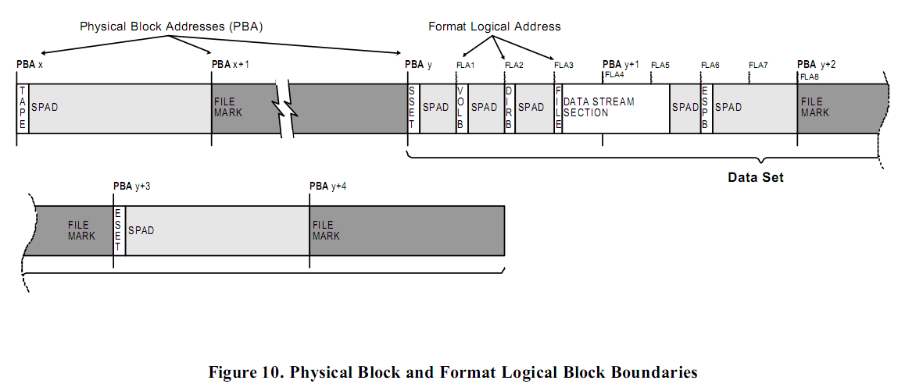
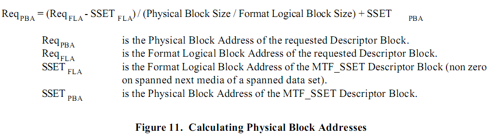

# 寻址

这部分描述了什么是物理块以及如何完成物理块和逻辑块的寻址和如何根据一个备份集中的描述块来计算一个物理块的地址。

## 物理块

术语“物理块”指的是设备写到可移动存储介质的最小字节数。
不同设备的物理块大小是不一样的。
很多磁带设备现在支持通过术语“物理块偏移”来获取磁带的当前位置。
在 MTF 中我们把这个位置称为 ***物理块地址（Physical  Block Address）*** ，缩写为 **PBA**。
这些设备同样支持通过一个给定的 PBA 来定位，这比那些需要重新卷带并且读取的老式磁带设备要快得多。

MTF 需要有能够根据一个数据集的开始 PBA，对象中的数据偏移来计算出 对象的 PBA 的能力。
换句话来说，_卷标_ 之前的 PBAs 必须是连续的。
对于媒介中的同一个位置不同的设备驱动器返回的 PBA 也必须的一致的。
给定一个 PBA，所有的设备驱动器必须寻找到媒介中的同一个位置。
需要注意的是，并不是所有的设备都能用这种方式来直接提供 PBA 的计算。
因此，它需要通过软件或者驱动来做这件事。
可以参考附录 L 来查看在特定设备中完成这件事的详细方法。

当设备写入一个物理块到媒介的时候，通常来说物理块会包含头信息，从主机传送去的数据信息，_CRC_ 校验信息以及 _ECC_。
头信息，CRC 和 ECC 是由设备自动添加的。
MTF 只会关注写到数据块的数据部分以及它的 PBA。
当我们讨论 PBA 的时候，我们是指磁带设备用于标志和定位物理块中的数据的地址。

## 格式化的逻辑块

如果每一个写到磁带的 DBLK 的 PBA 都存放在主磁盘的一个目录（catalog）中，那么它会大大减少从不同的存储媒介恢复的时间。
但是，这个方法存在一个问题：它需要所有的 DBLK 和物理块的边界对齐，这会导致明显的空间浪费。
对于一个物理块大小为 8K 的设备来说，每个 DBLK 的写入都会有几K的空间浪费。
在写入每个块之前它需要先取得这个写入地址，这会增加写操作完成的时间。
因此，_格式化的逻辑块_ 的概念被提出来了。
下图显示了属于数据集的多个 DBLKs 仅仅浪费了两个多一点的物理块空间用于定位。
这是使用了 _格式化的逻辑块_ 的原因。

通常来说，出现在每个数据集开头的 MTF\_SSET\_DBLK 会跟在 _卷标_ 后面，因此它通常会跟物理块的边界对齐。
它的 PBA 会通过磁带驱动设备获取并存储在MTF\_SSET\_DBLK。
所有的 DBLK 必须和 _格式化的逻辑块_ 的边界对齐。
在 **MTF Ver.1.00a** 中逻辑块的大小可以是 512 或者 1024 字节。
格式化的逻辑块的大小写在媒介开头的 MTF\_TAPE\_DBLK 中，
并且在整个媒介中要保持一致，如果整个数据集有跨越媒介的话在下一个媒介中也要保持不变。
比如，在一个磁带中的选择了 512 字节并且数据集跨越到另一个媒介，
那么下一个磁带中的 _格式化的逻辑块_ 的大小必须是 512 字节而不能是 1024 字节。

通过使用 DBLK 的 _格式化的逻辑块_ 的地址可以得到数据集中这个 DBLK 的地址。
这个地址称为 _格式化的逻辑地址（Format Logical Address）_ 缩写为 **FLA**。
FLA 指的是从数据集的开始的逻辑块的个数并且索引是从 0 开始的。
FLA 是一个无符号的 64 位整数。
数据集中的每一个 DBLK 都有一个唯一的 FLA 存储在它自己的 _公共的块头_ 结构中和 _基于媒介的 Catalog_ 的 文件/目录详细部分。
当恢复一个对象（卷，目录或者文件）的时候，FLA 可以和 MTF\_SSET 的 PBA 连结起来，用于计算和定位目标对象的准确位置。
例如：下图中的 MTF\_VOLB\_DBLK 可以通过 PBA 为“y”以及 FLA 为“1”精确地定位。

## 计算物理地址

MTF 的其中一个设计目标是快速地返回存储的数据。
每一个数据集中的 DBLK 都包含一个 FLA。
下面的计算提供了根据 FLA 来确定 DBLK 的物理地址的方法。
计算结果向下取整。

