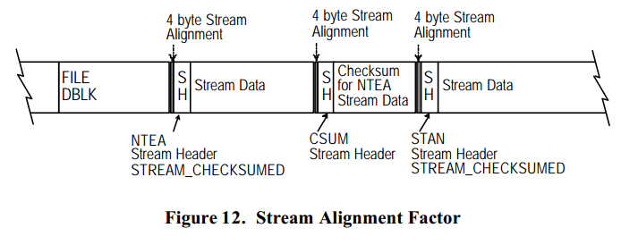
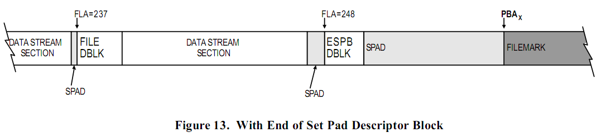
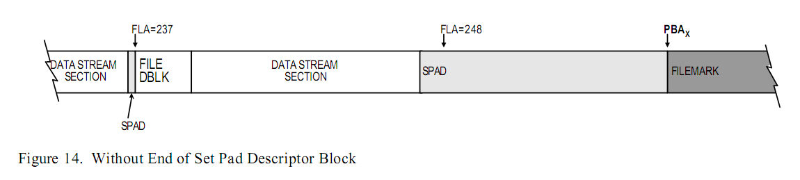

# 对齐

MTF 是一个必须将 DBLK 和 _数据流_ 按某个特定边界对齐的线性结构。
DBLK 按 _格式化逻辑块的边界_ 对齐而 _数据流_ 按 _流对齐因子_ 对齐。
_卷标_ 按物理块的边界对齐。

## 描述块

_描述块_ 必须按照 _格式化的逻辑块边界_ 对齐。
为了实现这个，所有的 DBLK 必须使用 _SPAD 数据流_ 作为最后一个和 DBLK 关联的数据流。

## 数据流

所有的 _数据流_ 按四字节的 _流对齐因子_ 对齐。
四字节的流对齐中使用 0 来作为填充模式（for C2 security）。
如果 _数据流_ 已经和 _流对齐因子_ 对齐，那么就不需要填充。
在下图中，文件描述块包含一个指向下一个事件（Next Event）的偏移的成员。
这个成员包含了 _文件描述块_ 的大小加上数据流按照四字节的流对齐因子对齐需要用到的字节数。

## 卷标

卷标总是写在物理块边界。
SPAD 数据流经常用于添加填充到下一个物理块边界从而使卷标可写。
_填充结束描述块_ 是用于 数据集前的第一个卷标的可选项。
（The End of Set Pad Descriptor Block may optionally be used in a
Data Set prior to the first filemark.）

