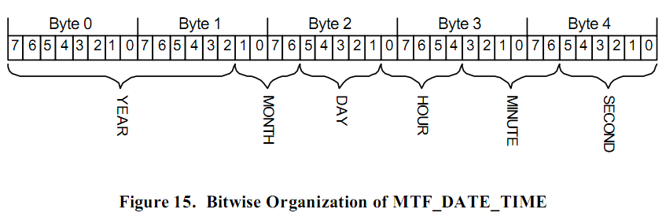
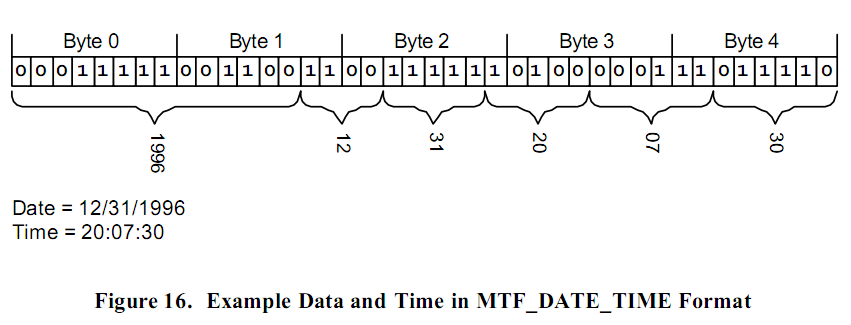

# 支撑结构

这部分详细介绍了在高级别的 MTF 结构（higher level MTF structures）中用到的支撑结构。
这些支撑结构是 DBLK 和 流的头（Stream Headers）的内部结构。
下面描述的三个支撑结构由一些特定长度的成员组成，每一个都有特定的功能。
它们被高级别的结构使用。

> **注意**：所有的多字节实体都以 INTEL（little endian）格式编写。

## UINT64

这个低级别的结构提供了一个在 DBLK 结构中指定 64 位无符号整数的方法。

<table>
  <tr>
    <th>偏移</th><th>内容</th><th>类型</th><th>大小</th>
  </tr>
  <tr>
    <td>0 0h</td><td>低32位</td><td>UINT32</td><td>4 字节</td>
  </tr>
  <tr>
  <td>4 4h</td><td>高32位</td><td>UINT32</td><td>4 字节</td>
  </tr>
  <caption>结构1. UINT64</caption>
</table>

## MTF\_TAPE\_ADDRESS

低级别的 MTF\_TAPE\_ADDRESS 结构用于在 _公共的块头_ 内部和一些 DBLK 内部指定不是固定长度的信息。
这个结构一共四个字节长，由两个二字节的成员组成。
第一个成员（Size）指定了变长区域的大小。
第二个成员（Offset）指定了从 MTF\_TAPE\_ADDRESS 算起的区域的开始偏移。

<table>
  <tr>
    <th>偏移</th><th>字段名</th><th>类型</th><th>大小</th>
  </tr>
  <tr>
    <td>0 0h</td><td>低32位</td><td>UINT16</td><td>2 字节</td>
  </tr>
  <tr>
  <td>2 2h</td><td>高32位</td><td>UINT16</td><td>2 字节</td>
  </tr>
  <caption>结构2. MTF\_TAPE\_ADDRESS</caption>
</table>

## MTF_DATE_TIME

MTF\_DATE\_TIME 是一个使用单个 5 字节的成员来包含精度为秒的时间和日期的低级别结构。
使用这个结构的地方是 MTF\_FILE 和 MTF\_DIRB DBLK 用于指定文件和目录创建时间，修改时间等。
MTF\_DATE\_TIME 的定义如下所示。
一个未知或者未定义的时间和日期用 5 个值为 0 的字节表示。

<table>
  <tr>
    <th>偏移</th><th>内容</th><th>类型</th><th>大小</th>
  </tr>
  <tr>
    <td>0 0h</td><td>如下所示的 40 比特的日期和时间封装</td><td>UINT8[5]</td><td>5 字节</td>
  </tr>
  <caption>结构3. MTF\_DATE\_TIME</caption>
</table>

