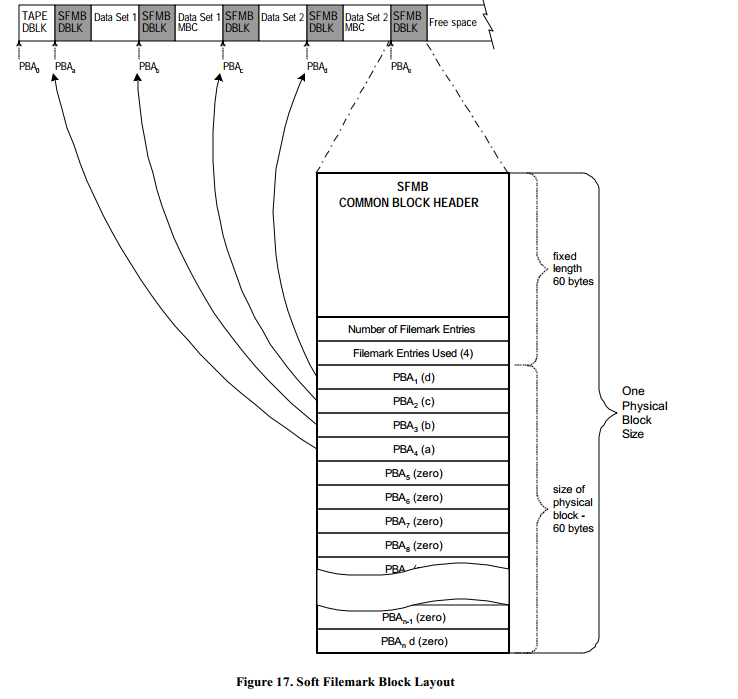

# 软卷标描述块（MTF_SFMB）

**软卷标描述块**（MTF_SFMB）当硬件不支持卷标的时候用来模拟卷标。
设置 MTF\_TAPE DBLK 的磁带属性字段来启用软卷标。
MTF\_TAPE DBLK 的软卷标块大小字段决定了 MTF\_SFMB DBLK 的大小。
MTF\_SFMB DBLK 必须设置为能从物理块边界开始和在物理块边界结束。
MTF\_SFMB DBLK 不能有关联的数据流。
MTF\_SFMB DBLK 包含了上一个卷标的一个数组的物理块地址。
如果数组中个一个入口没有被使用，那么它需要被设为 0。

<table>
  <tr>
    <th>偏移</th><th>内容</th><th>类型</th><th>大小</th>
  </tr>
  <tr>
    <td>&nbsp;0 &nbsp;0h</td><td>公共的块头</td><td>MTF\_DB\_HDR<td>52 字节</td>
  </tr>
  <tr>
    <td>52 34h</td><td>卷标条目数</td><td>UINT32</td><td>4 字节</td>
  </tr>
  <tr>
    <td>56 38h</td><td>已使用的卷标条目</td><td>UINT32</td><td>4 字节</td>
  </tr>
  <tr>
    <td>60 3Ch</td><td>先前的卷标数组的 PBA</td><td>UINT32</td><td>sizeof (MTF_SFMB) - 60</td>
  </tr>
  <caption>**结构 14. 软卷标描述块**</caption>
</table>

## 公共的块头 {52 bytes}

公共的块头 字段是一个在每个 DBLK 开头的 52 字节的 MTF\_DB\_HDR 结构。
MTF\_DB\_HDR 结构的下列成员必须设为定义的值。

* DBLK 类型字段设置为 'SFMB'。
* 格式化的逻辑地址字段设为从媒介开头一共有多少个物理块。
* 控制块 ID 字段用于错误恢复。媒体簇中的第一个 MTF\_SFMB DBLK 有一个值为 1 的 控制块 ID。在数据集内后面的 MTF\_SFMB DBLK 的控制块 ID 比前一个 MTF\_SFMB DBLK 的控制块 ID 大 1。

## 卷标条目数 {4 bytes}

卷标条目数 是一个 4 字节的包含了上一个 PBA 的卷标数组有多少个卷标的字段。

## 已使用的卷标条目 {4 bytes}

已使用的卷标条目 是一个 4 字节的包含上一个 PBA 的卷标数组有多少个有效的卷标的字段。

## 先前的卷标数组的 PBA {4 byte elements}

先前的卷标数组的 PBA 字段是一个卷标元素的数组。
每个卷标元素是一个上一个卷标的 4 字节的 PBA。
上一个卷标数组的 PBA 是累积的。
条目总是按降序排。
当先前的文件标记的数量超过了数组中的条目数，数组是用最接近数据结尾（EOD）的条目来填充的。
如果数组中的条目没被使用，那么它的值会被设为 0。

> 编程注意事项：MTF\_SFMB DBLK 包含了累积的卷标 PBAs 列表。
为了创建一个直到数据结尾的卷标列表。读取 MTF\_SFMB DBLK。
如果卷标条目等于已使用的卷标条目，
那么必须读取先前的 MTF\_SFMB DBLKs 来创建完整的卷标列表。
