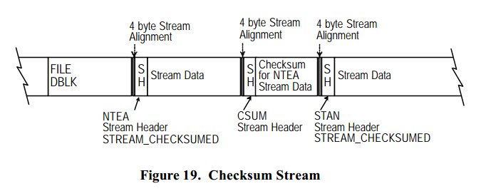
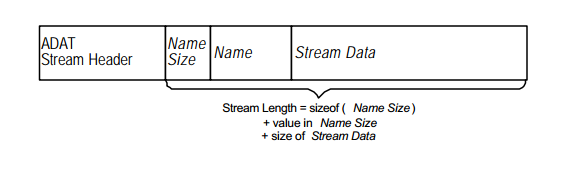

# 流数据

流数据紧跟着流头的校验字段。
本部分说明了不同流 ID 类型的流数据格式。

## 平台无关的流数据

本部分说明了与操作系统无关的数据流。

<table>
  <caption>**表 19. 平台无关的流数据类型**</captioN>
  <tr>
    <th>名称</th><th>说明</th><th>值</th>
  </tr>
  <tr>
    <td>STANDARD\_DATA\_STREAM</td><td>标准的文件数据流。</td><td>'STAN'</td>
  </tr>
  <tr>
    <td>PATH\_NAME\_STREAM</td><td>放在流的目录名。</td><td>'PNAM'</td>
  </tr>
  <tr>
    <td>FILE\_NAME\_STREAM</td><td>支持扩展长度的文件名。</td><td>'FNAM'</td>
  </tr>
  <tr>
    <td>CHECKSUM\_STREAM</td><td>前一个数据的校验。</td><td>'CSUM'</td>
  </tr>
  <tr>
    <td>CORRUPT\_STREAM</td><td>前一个流是损坏的。</td><td>'CRPT'</td>
  </tr>
  <tr>
    <td>PAD\_STREAM</td><td>填充到下一个 DBLK 流。</td><td>'SPAD'</td>
  </tr>
  <tr>
    <td>SPARSE\_STREAM</td><td>稀疏流。</td><td>'SPAR'</td>
  </tr>
  <tr>
    <td>MBC\_LMO\_SET\_MAP\_STREAM</td><td>查看 第一类 MBC。</td><td>'TSMP'</td>
  </tr>
  <tr>
    <td>MBC\_LMO\_FDD\_STREAM</td><td>查看 第一类 MBC。</td><td>'TFDD'</td>
  </tr>
  <tr>
    <td>MBC\_SLO\_SET\_MAP\_STREAM</td><td>查看 第二类 MBC。</td><td>'MAP2'</td>
  </tr>
  <tr>
    <td>MBC\_SLO\_FDD\_STREAM</td><td>查看 第二类 MBC。</td><td>'FDD2'</td>
  </tr>
</table>

### 标准数据流（STANDARD_DATA_STREAM）

当流头的流 ID 字段设为 'STAN' 时表示数据流为标准数据流。
标准数据流包含普通的文件数据。

> Window NT 注意事项：
当使用 Win32 BackupRead API 的时候，与读对象关联的每个数据流都有一个
Win32 流头在前面。这个 Win32 流头应该拿来填充 MTF 流头的信息，但不需要作为数据流的一部分写到媒介中。

> 对于标准数据，WIN32\_STREAM\_ID 的 dwStreamId 字段应该设为 BACKUP\_DATA。

### 在流的目录名（PATH\_NAME\_STREAM）

当流头的流 ID 字段设为 'PNAM' 时表示数据流为在流的目录名。
MTF 的 DBLK 大小在 MTF\_TAPE DBLK 格式化的逻辑块大小限制。
如果由于添加目录名到 MTF\_DIRB DBLK 会导致新的大小超过了
格式化的逻辑块大小的话，目录名会放在和 MTF\_DIRB DBLK
关联的第一个数据流中。
在 MTF\_DIRB DBLK 的目录属性中 PATH\_IN\_STREAM 必须设置。

> 注意：当发生跨越时，在流中的目录名必须与续集的  MTF\_DIRB DBLK 关联。

### 在流的文件名（FILE\_NAME\_STREAM）

当流头的流 ID 字段设为 'FNAM' 时表示数据流为在流的文件名。
MTF 的 DBLK 大小在 MTF\_TAPE DBLK 格式化的逻辑块大小限制。
如果由于添加文件名到 MTF\_FILE DBLK 会导致新的大小超过了
格式化的逻辑块大小的话，文件名会放在和 MTF\_FILE DBLK
关联的第一个数据流中。
在 MTF\_FILE DBLK 的目录属性中 FILE\_IN\_STREAM 必须设置。

> 注意：当发生跨越时，在流中的文件名必须与续集的  MTF\_FILE DBLK 关联。

### 校验流（CHECKSUM\_STREAM）

当流头的流 ID 字段设为 'CSUM' 时表示数据流为校验流。
校验流用于验证流数据的一致性。
每个和 DBLK 关联的数据流都可以有一个校验流。
如果一个数据流要校验数据的一致性，流头的流媒介格式属性必设置
STREAM\_CHECKUMED 比特并且紧跟在数据流后面的必须是校验流（CSUM）。

校验是一个线性流数据的 32位（4 字节）的 异或 和。
和流数据如何分段无关，用于生成 32 位校验和的软件算法必须保持一致。
比如，如果流数据是分段为 1，2,3,或 4 字节，算法应该生成同样的 32位校验。

### 损坏流（CORRUPT_STREAM）

当流头的流 ID 字段设为 'CRPT' 时表示数据流为损坏流。
损坏流和 MTF\_CFIL DBLK 联合起来表示流是损坏的。
MTF\_CFIL DBLK 有只能标识单个数据流是损坏的限制。
损坏流和损坏的数据流一一对应。
损坏流没有任何流数据。

### 填充流（PAD_STREAM）

当流头的流 ID 字段设为 'SPAD' 时表示数据流为填充流。
填充流通常是与 DBLK 关联的最后一个流。
填充流用于指示没有其的数据流和 DBLK 关联并且填充到对齐下一个格式化的逻辑块，使得下一个 DBLK 或者 卷标 可以放置。
如果填充流刚好在卷标前面，填充流同时需要填充到对齐物理块边界。
填充流的数据需要设置为 NULL（二进制的 0）来维持 C2 安全级别。

> 注意：前期的 MTF Version 1.0 specification 不需要填充流。
在这种情况下，MTF\_DB\_HDR 的 Offset To First Event 字段
会指向 DBLK 而不是数据流。
在这种情况下，你应该读取流头的大小然后验证校验。
如果校验和预计的一样，那么这是一个流头。
如果不相等，那么需要读取 MTF\_DB\_HDR 的大小然后检查校验和。
如果校验符合，那么这是一个 DBLK。
如果不符合，需要尝试恢复错误以及寻找下一个 DBLK。

### 稀疏流（SPARSE_STREAM）

当流头的流 ID 字段设为 'SPAR' 时表示数据流为稀疏流。
稀疏帧头紧跟在流头，并且在流长包含。
稀疏帧头指定稀疏文件的偏移。
稀疏数据的长度是流长度减去稀疏帧头。

<table>
  <tr>
    <th>偏移</th><th>内容</th><th>类型</th><th>大小</th>
  </tr>
  <tr>
    <td>&nbsp;0 &nbsp;0h</td><td>稀疏文件的偏移</td><td>UINT64</td><td>8 字节</td>
  </tr>
  <caption>**结构 17. 稀疏帧头**</caption>
</table>

## Windows NT 流数据

本节说明了特定于 Windows NT 操作系的数据流。
大多数的 NT 流是基于使用 Win32 BackupRead API。
在数据前面的是 Win32 流头（WIN32\_STREAM\_ID）
来指定跟随的数据的类型。
Win32 流头用于填充 MTF 流头，但是不作为流数据的一部分。

<table>
  <caption>**表 20. Windows NT 流数据类型**</caption>
  <tr>
    <th>名称</th><th>说明</th><th>值</th>
  </tr>
  <tr>
    <td>STANDARD\_DATA\_STREAM</td><td>查看上面关于 Windows NT 的问题。</td><td>'STAN'</td>
  </tr>
  <tr>
    <td>SPARSE\_STREAM</td><td>Windows NT 稀疏文件。BACKUP\_SPARSE\_DATA 使用平台无关的 SPARSE_STREAM。</td><td>'SPAR'</td>
  </tr>
  <tr>
    <td>NTFS\_ALT\_STREAM</td><td>NT 备用数据流。</d><td>'ADAT'</td>
  </tr>
  <tr>
    <td>NTFS\_EA\_STREAM</td><td>NT 扩展信息数据流。</td><td>'NACL'</td>
  </tr>
  <tr>
    <td>NT\_SECURITY\_STREAM</td><td>NT 特定的安全数据流。</td><td>'NACL'</td>
  </tr>
  <tr>
    <td>NT\_ENCRYPTED\_STREAM</td><td>NT 加密数据流。</td><td>'NTED'</td>
  </tr>
  <tr>
    <td>NT\_QUOTA\_STREAM</td><td>NT 配额数据流。</td><td>'NTQU'</td>
  </tr>
  <tr>
    <td>NT\_PROPERTY\_STREAM</td><td>NT 属性数据流。</td><td>'NTPR'</td>
  </tr>
  <tr>
    <td>NT\_REPARSE\_STREAM</td><td>NT 重分析数据流。</td><td>'NTRP'</td>
  </tr>
  <tr>
    <td>NT\_OBJECT\_ID\_STREAM</td><td>NT 对象 ID 数据流。</td><td>'NTOI'</td>
  </tr>
</table>

### Windows NT 备用数据流 (NTFS_ALT_STREAM)

当流头的流 ID 字段设为 'ADAT' 时表示数据流为 Windows NT 备用数据流。 对于 Windows NT 备用数据流来说，WIN32\_STREAM\_ID 字段的 dwStreamId
需要设置为 BACKUP\_ALTERNATE\_DATA。

在 MTF 中，Windows NT 备用数据流需要一些特殊的处理。
对这些流来说 MTF 流头和平常一样，流类型字段为 'ADAT'。
但是，一个 4 字节的流名称大小字段以及流名称字段需要放在
MTF 数据流真正数据的前面，MTF 的流头的大小字段包括了
4 字节流名称大小字段和跟着的流名称。
这个名称的字符类型是 UNICODE，而大小是字节大小，不包括 NULL 结束符。

### Windows NT 扩展信息数据流（NTFS_EA_STREAM）

当流头的流 ID 字段设为 'NTEA' 时表示数据流为 Windows NT 扩展属性信息数据流。
对于  Windows NT 扩展属性信息来说，WIN32\_STREAM\_ID 字段的 dwStreamId 需要设置为 BACKUP\_EA\_DATA。

### Windows NT 安全数据（NT\_SECURITY\_STREAM）

当流头的流 ID 字段设为 'NACL' 时表示数据流为 Windows NT 安全数据。
对于  Windows NT 安全数据来说，WIN32\_STREAM\_ID 字段的 dwStreamId 需要设置为 BACKUP\_SECURITY\_DATA。

> 注意：流头的流文件系统属性字段必须设置 STREAM\_CONTAINS\_SECURITY 比特。

### Windows NT 加密数据（NT\_ENCRYPTED\_STREAM）

当流头的流 ID 字段设为 'NTED' 时表示数据流为 Windows NT 加密数据。
数据通过 Windows NT 加密 APIs 而不是 BackupRead 获取。

### Windows NT 配额数据（NT\_QUOTA\_STREAM）

当流头的流 ID 字段设为 'NTQU' 时表示数据流为 Windows NT 配额数据。
数据通过 Windows NT 配额 APIs 而不是 BackupRead 获取。

### Windows NT 属性数据（NT\_PROPERTY\_STREAM）

当流头的流 ID 字段设为 'NTPR' 时表示数据流为 Windows NT 属性数据。
对于 Windows NT 属性数据，WIN32\_STREAM\_ID 字段的 dwStreamId
字段的值应该设为 BACKUP\_PROPERTY\_DATA。

### Windows NT 重分析数据（NT\_REPARSE\_STREAM）

当流头的流 ID 字段设为 'NTRP' 时表示数据流为 Windows NT 重分析数据。
对于 Windows NT 重分析数据，WIN32\_STREAM\_ID 字段的 dwStreamId
字段的值应该设为 BACKUP\_REPARSE\_DATA。

### Windows NT 对象 ID 数据（NT\_OBJECT\_ID\_STREAM）

当流头的流 ID 字段设为 'NTOI' 时表示数据流为 Windows NT 对象 ID 数据。
对于 Windows NT 对象 ID 数据，WIN32\_STREAM\_ID 字段的 dwStreamId
字段的值应该设为 BACKUP\_OBJECT\_ID。

## Windows 95 流数据

略

## NetWare 流数据

略

## OS/2 流数据

略

## Macintosh 流数据

略
