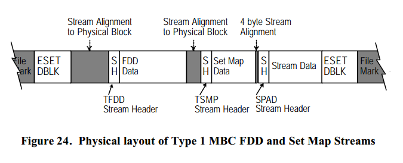

# 第一类 MBC

本节说明第一类 MBC。
可以在第三部分的 格式说明 查看 基于媒介的 Catalog 的概述。
第一类 MBC 包括 FDD 和 Set Map。
都是和 MTF\_ESET DBLK 关联的流。
FDD 包括数据集中 MTF\_VOLB，MTF\_DIRB 和 MTF\_FILE DBLKs 的条目。
第一类 MBC 被设计为允许其他 DBLK 类型的条目，
包括销售特定类型，如果应用程序不认识 FDD 中的某些条目可以简单地跳过。
然而，我们只讨论上面提到的 DBLKs。

为了常见第一类 MBC，MTF\_TAPE DBLK 的 基于媒介的 Catalog 类型字段应该设为 1，而 MTF\_SSET DBLK 的 媒介 Catalog 版本字段应该设为 2。

## 物理层次

Set Map 和 FDD 都是作为与 MTF\_ESET 关联的数据流，以及与物理块边界对齐从而允许应用程序可以直接找到它。
先写 FDD，然后是 Set Map。
它允许 FDD 和 Set Map 都写，或者只写 Set Map 流，但是只写 FDD 是不允许的。
注意：FDD 可以只在某些数据集添加，但是 Set Map 必须在每个数据集都添加，因为它会添加到媒体簇。

第二个 MTF\_ESET DBLK 跟在 Set Map 流的下一个物理边界，并且它的后面会跟在一个卷标来结束整个数据集。
FDD 和 Set Map 和物理块地址包含在第二个 MTF\_ESET DBLK 的 8 字节的字段中。
其他的两个字节的字段提供了 FDD 开始的媒介序号。
请查看 MTF\_ESET DBLK 的说明来获取这些字段的更多信息。

FDD 的最后一个条目是一个特殊的“结束条目”，它允许 FDD 流填充从而保证
Set Map 从物理块边界开始。
Set Map 和第二个 MTF\_ESET 的间隙使用填充流填充，
第二个 MTF\_ESET 和 卷标之间的间隙也是一样。

当媒体簇跨越多个媒介时，每个媒介结尾的 MTF\_EOTM DBLK 都
包含最后一个数据集的第二个 MTF\_ESET 的 PBA。

第二个 MTF\_ESET 的第一个预留给 MBC 的字段用于存储 'TFDD' 流头的 PBA。
第二个 MTF\_ESET 的第二个预留给 MBC 的字段用于存储 'TSMP' 流头的 PBA。

下图演示了 catalogs 的物理位置。

## 文件/目录 细节

文件/目录 细节（FDD）用于说明属于某个数据集的卷，目标和文件树。
FDD 可以用于快速确定单独的卷，目录和文件在媒介的哪个地方。
FDD 可以认为是数据集的 DBLKs 除去跟随的数据流后简短的拷贝。
只有 DBLK 中用于定位和获取数据集中单独项的信息需要放在 FDD 流中。

### FDD 物理层次

FDD 就如 Set Map，在物理块边界开始。
FDD 的流头的 流ID 字段的值为 'TFDD'。
请参考数据流部分来获取更多信息。
MTF 流头标识是 FDD 然后跟随着一系列的 FDD 条目。

一共有 4 种的 FDD 条目：MTF\_FDD\_VOLB，MTF\_FDD\_DIRB，
MTF\_FDD\_FILE 和 MTF\_FDD\_FEND。
FDD 的每个条目都以公共头开始（MTF\_FDD\_HDR），
并且跟着的是若干字段的信息。
这和 DBLKs 在开头使用 MTF\_DB\_HDR 类似。
在数据集中，每个 FDD 都有一个与之关联的 DBLK 结构。
FDD 中 FDD 条目的数量和顺序与数据集中 DBLKs 出现的一一对应，
唯一的例外是跨越的 DBLK 的续集的情况。
FDD 中的最后条目是 FEND 条目。

### FDD 公共头

FDD 公共头是一个 36 字节的放在每个 FDD 条目开头的公共头。
FDD 公共头由条目的长度，类型，属于的媒介和其他通常与 DBLK 重复的字段组成。

<table>
  <tr>
    <th>偏移</th><th>字段名</th><th>类型</th><th>大小</th>
  </tr>
  <tr>
    <td>&nbsp;0 &nbsp;0h</td><td>LENGTH</td><td>UINT16</td><td>2 字节</td>
  </tr>
  <tr>
    <td>&nbsp;2 &nbsp;2h</td><td>TYPE</td><td>UINT8[4]</td><td>4 字节</td>
  </tr>
  <tr>
    <td>&nbsp;6 &nbsp;6h</td><td>MEDIA\_SEQ\_NUMBER</td><td>UINT16</td><td>2 字节</td>
  </tr>
  <tr>
    <td>&nbsp;8 &nbsp;8h</td><td>COMMON\_BLOCK\_ATTRIBUTES</td><td>UINT32</td><td>4 字节</td>
  </tr>
  <tr>
    <td>12 0Ch</td><td>FORMAT\_LOGICAL\_ADDRESS</td><td>UINT64</td><td>8 字节</td>
  </tr>
  <tr>
    <td>20 14h</td><td>DISPLAYABLE\_SIZE</td><td>UINT64</td><td>8 字节</td>
  </tr>
  <tr>
    <td>28 1Ch</td><td>LINK</td><td>INT32</td><td>4 字节</td>
  </tr>
  <tr>
    <td>32 20h</td><td>OS\_ID</td><td>UINT8</td><td>1 字节</td>
  </tr>
  <tr>
    <td>33 21h</td><td>OS\_VERSION</td><td>UINT8</td><td>1 字节</td>
  </tr>
  <tr>
    <td>34 22h</td><td>STRING\_TYPE</td><td>UINT8</td><td>1 字节</td>
  </tr>
  <tr>
    <td>35 23h</td><td>PAD UINT8</td><td>UINT8</td><td>1 字节</td>
  </tr>
  <caption>**结构 26. 第一类 MBC FDD 公共头（MTF\_FDD\_HDR）**</caption>
</table>

#### LENGTH {2 bytes}

LENGTH 字段指明 FDD 记录流的大小。
这个大小应该等于 MTF\_FDD\_FILE，MTF\_FDD\_DIRB，MTF\_FDD\_VOLB 或者 MTF\_FDD\_FEND 记录流的大小加上任何附加到这个结构的字符串的大小。
跟在特定 FDD 条目的正式字段后的附加字符串包括机器名，卷，目录和文件。

#### TYPE {4 bytes}

TYPE 字段指明这个头属于哪个 MTF\_FDD 记录。
TYPE 的值应该为 'VOLB','DIRB','FILE' 或 'FEND'。
如果块的类型是 'FEND'，块中剩余的字段是未定义的应该设为 0。

#### MEDIA\_SEQ\_NUMBER {2 bytes}

MEDIA\_SEQ\_NUMBER 标识这个 FDD 属于媒体簇中哪个媒介。

#### COMMON\_BLOCK\_ATTRIBUTES {4 bytes}

COMMON\_BLOCK\_ATTRIBUTES 字段应该与关联的数据集中的 MTF\_DB\_HDR
的相应字段相等。
因此，关于续集，压缩，媒介尾，变长流，等。
可以从这些属性中获得。

#### FORMAT LOGICAL ADDRESS {8 bytes}

FORMAT LOGICAL ADDRESS 字段应该与关联的数据集中的 MTF\_DB\_HDR
的相应字段相等。
这个值用于定位和这个 FDD 流条目关联的 DBLK。

#### DISPLAYABLE\_SIZE {8 bytes}

DISPLAYABLE\_SIZE 字段应该与关联的数据集中的 MTF\_DB\_HDR
的相应字段相等。
在这种情况下，只要查看 FDD 条目的这个字段，应用程序就可以快速的决定
和显示数据集中所有文件的大小。

#### LINK {4 bytes}

MTF\_FDD\_HDR 结构的 LINK 字段指示另一个 FDD 条目的偏移。
依赖于 FDD 条目使用的类型 LINK 有不同的含义。

* 文件条目 父目录的流偏移。
* 卷条目 下一个卷条目的流偏移，如果是最后一个 MTF\_FDD\_VOLB 条目那么这个字段为 0。
* 目录条目 下一个兄弟目录的流偏移，如果是最后一个目录则为 0。

#### OS\_ID {1 byte}

OS\_ID 字段是另一个与关联的数据集中的 MTF\_DB\_HDR
的相应字段相等。

#### OS\_VERSION {1 byte}

OS\_VERSION 字段也与关联的数据集中的 MTF\_DB\_HDR
的相应字段相等。

#### STRING\_TYPE {1 byte}

STRING\_ID 字段与关联的数据集中的 MTF\_DB\_HDR
的相应字段相等。

#### PAD {1 byte}

PAD 字段只是为了提高 RISC 处理器使用 MTF 的性能而填充 0 到下一个 4 字节边界。
其他的 FDD 条目从这个边界开始。

### FDD 条目

FDD 中一共有四种的记录类型。
其中的三种用于表示本 FDD 说明的数据集中的卷，目录和文件对象。
这些 FDD 条目的很多字段都和 MTF\_VOLB，MTF\_DIRB 和 MTF\_FILE DBLK 的字段重复。
这四种 FDD 条目为：

<table>
  <caption>**表 26. 第一类 FDD 条目类型**</caption>
  <tr>
    <th>名称</th><th>说明</th><th>值</th>
  </tr>
  <tr>
    <td>MTF\_FDD\_VOLB</td><td>FDD 卷条目</td><td>'VOLB'</td>
  </tr>
  <tr>
    <td>MTF\_FDD\_DIRB</td><td>FDD 目录条目</td><td>'DIRB'</td>
  </tr>
  <tr>
    <td>MTF\_FDD\_FILE</td><td>FDD 文件条目</td><td>'FILE'</td>
  </tr>
  <tr>
    <td>MTF\_FDD\_FEND</td><td>FDD 结束条目</td><td>'FEND'</td>
  </tr>
</table>

#### FDD 卷条目（MTF_FDD_VOLB）

FDD 卷条目和它表示的数据集的 VOLB DBLK 关联。
这个结构的很多字段都是拷贝自 VOLB DBLK 字段。

<table>
  <tr>
    <th>偏移</th><th>字段名称</th><th>类型</th><th>大小</th>
  </tr>
  <tr>
    <td>&nbsp;0 &nbsp;0h</td><td>FDD 公共头</td><td>MTF\_FDD\_HDR</td><td>36 字节</td>
  </tr>
  <tr>
    <td>36 24h</td><td>VOLB 属性</td><td>UINT32</td><td>4 字节</td>
  </tr>
  <tr>
    <td>40 28h</td><td>设备名</td><td>MTF\_TAPE\_ADDRESS</td><td>4 字节</td>
  </tr>
  <tr>
    <td>44 2Ch</td><td>卷名</td><td>MTF\_TAPE\_ADDRESS</td><td>4 字节</td>
  </tr>
  <tr>
    <td>48 30h</td><td>机器名</td><td>MTF\_TAPE\_ADDRESS</td><td>4 字节</td>
  </tr>
  <tr>
    <td>52 34h</td><td>OS\_SPECIFIC\_DATA</td><td>MTF\_TAPE\_ADDRESS</td><td>4 字节</td>
  </tr>
  <tr>
    <td>57 38h</td><td>媒介写日期</td><td>MTF\_DATE\_TIME</td><td>5 字节</td>
  </tr>
  <caption>**结构 27. 第一类 MBC FDD 卷条目（MTF\_FDD\_VOLB）**</caption>
</table>

##### FDD 公共头 {36 bytes}

FDD 公共头包含了每个 FDD 条目开头都有的 36 字节的 MTF\_FDD\_HDR 结构。
在前面已经介绍了这个结构。
MTF\_FDD\_HDR 的 TYPE 字段的值为 'VOLB'。

##### 卷属性 {4 bytes}

卷属性 字段与在数据集中关联的 MTF\_VOLB DBLK 的卷属性字段相同。
参考 MTF\_VOLB DBLK 描述块 来获取关于本字段的更多信息。

##### 设备名 {4 bytes}

设备名 使用 4 字节的 MTF\_TAPE\_ADDRESS 结构。
这个字段与数据集中关联的 MTF\_VOLB DBLK 的设备名字段相同，
除了：这个字段的第二个双字节的偏移基于 MTF\_FDD\_VOLB 条目的开头的。

##### 卷名 {4 bytes}

卷名字段也是使用 4 字节的 MTF\_TAPE\_ADDRESS 结构并且和关联的 MTF\_VOLB DBLK 的 卷名字段相同。
MTF\_TAPE\_ADDRESS 的 Offset 字段是从这个 MTF\_FDD\_VOLB 条目开始的偏移指向卷名字符串的开头。

##### 机器名 {4 bytes}

机器名字段同样使用 4 字节的 MTF\_TAPE\_ADDRESS 结构并且与关联的 MTF\_VOLB DBLK 的机器名字段相同。
MTF\_TAPE\_ADDRESS 的 Offset 字段是本 MTF\_FDD\_VOLB 条目的开始算起的偏移指向包含机器名的字符串。

##### OS_SPECIFIC_DATA {4 bytes}

OS Specific Data 字段使用 4 字节的 MTF\_TAPE\_ADDRESS 结构。
它的内容要么是 0 要么是与 MTF\_VOLB\_DBLK 关联的 MTF\_DB\_HDR 的 OS Specific Data 字段相同。
Offset 字段包含了这个 MTF\_FDD\_VOLB 条目开头算起的偏移指向包含 MTF\_VOLB DBLK 需要的 OS 信息的拷。

##### 媒介写日期 {5 bytes}

媒介写日期 使用 MTF\_DATE\_TIME 结构与关联的 MTF\_VOLB DBLK 的媒介写日期 字段相同。

#### FDD 目录条目（MTF\_FDD\_DIRB）

FDD 目录条目对应数据集中的 MTF_DIRB DBLK 条目。
这个结构的很多字段是从 MTF_DIRB DBLK 的相应字段复制过来的。

<table>
  <tr>
    <th>偏移</th><th>字段名</th><th>类型</th><th>大小</th>
  </tr>
  <tr>
    <td>&nbsp;0 &nbsp;0h</td><td>FDD 公共头</td><td>MBC\_FDD\_HDR</td><td>36 字节</td>
  </tr>
  <tr>
    <td>36 24h</td><td>最后访问日期</td><td>MTF\_DATE\_TIME</td><td>5 字节</td>
  </tr>
  <tr>
    <td>41 29h</td><td>创建日期</td><td>MTF\_DATE\_TIME</td><td>5 字节</td>
  </tr>
  <tr>
    <td>46 2Eh</td><td>备份日期</td><td>MTF\_DATE\_TIME</td><td>5 字节</td>
  </tr>
  <tr>
    <td>51 33h</td><td>最后访问日期</td><td>MTF\_DATE\_TIME</td><td>5 字节</td>
  </tr>
  <tr>
    <td>56 38h</td><td>目录属性</td><td>UINT32</td><td>4 字节</td>
  </tr>
  <tr>
    <td>60 3Ch</td><td>目录名</td><td>MTF\_TAPE\_ADDRESS</td><td>4 字节</td>
  </tr>
  <tr>
    <td>64 40h</td><td>OS\_SPECIFIC\_DATA</td><td>MTF\_TAPE\_ADDRESS</td><td>4 字节</td>
  </tr>
  <caption>**结构 28. 第一个类 MBC FDD 目录条目（MTF\_FDD\_DIRB）**</caption>
</table>

##### FDD 公共头 {36 bytes}

FDD 公共头字段是一个 36 字节的 MTF\_FDD\_HDR 结构，存在每个 FDD 条目流的开头。
这个结构在前面已经说明。
MTF_FDD_HDR 的 TYPE 字段应该为 'DIRB'。

##### 最后修改时间 {5 bytes}

最后修改时间使用 5 字节的 MTF\_DATE\_TIME 结构，和关联的 MTF\_DIRB DBLK 的最后修改时间字一样。-

##### 创建日期 {5 bytes}

创建日期 字段是另一个 5 字节的使用 MTF\_DATE\_TIME 结构的字段。
这个字段包含了目录第一个创建的日期和时间。
这个字段包含的内容与关联的 MTF_DIRB DBLK 相关字段一样。

##### 备份日期 {5 bytes}

备份日期字段是另一个 5 字节的 MTF\_DATE\_TIME 字段，包含了目录上一次备份的日期和时间。
这与关联的数据集中的 MTF\_DIRB DBLK 相关字段一样。

##### 最后访问日期 {5 bytes}

最后访问日期 字段同样使用 5 字节的 MTF\_DATE\_TIME 结构来描述目录最后访问的日期和时间。
这里的数据 MTF\_DIRB DBLK 中的相同字段是一样的。

##### 目录属性 {4 bytes}

目录属性字段是由 4 个字节组成的 32 位字段。
目录属性定义了 MTF\_DIRB DBLK 代表的目录的行为。
这个字段和 MTF\_DIRB DBLK 的对应字段一样。

##### 目录名 {4 bytes}

目录名字段是一个 4 字节的 MTF\_TAPE\_ADDRESS 结构，用于指定这个目录的名称的位置和大小。
Offset 字段指定本 MTF\_FDD\_DIRB 条目开头与包含了目录名的字符串之间的偏移。

##### OS\_SPECIFIC\_DATA {4 bytes}

OS\_SPECIFIC\_DATA 字段使用 4 字节的 MTF\_TAPE\_ADDRESS 结构：它的内容要么是 0，要么是与之关联的 MTF\_DIRB DBLK 的 MTF\_DB\_HDR 的对应字段的复制。
Offset 字段包含了从这个 MTF\_FDD\_DIRB 条目开始算起到关联的 MTF_DIRB DBLK 使用的 OS 信息的字符串的偏移。

#### FDD 文件条目（MTF\_FDD\_FILE）

FDD 文件条目与数据集中的 MTF\_FILE DBLK 关联。
这个结构的很多字段都是从 MTF\_FILE DBLK 的对应字段复制过来的。

<table>
  <tr>
    <th>偏移</th><th>字段名</td><td>类型</th><th>大小</th>
  </tr>
  <tr>
    <td>&nbsp;0 &nbsp;0h</td><td>FDD 公共头</td><td>MTF\_FDD\_HDR</td><td>36 字节</td>
  </tr>
  <tr>
    <td>36 24h</td><td>最后修改时间</td><td>MTF\_DATE\_TIME</td><td>5 字节</td>
  </tr>
  <tr>
    <td>41 29h</td><td>创建日期</td><td>MTF\_DATE\_TIME</td><td>5 字节</td>
  </tr>
  <tr>
    <td>46 2Eh</td><td>备份日期</td><td>MTF\_TAPE\_TIME</td><td>5 字节</td>
  </tr>
  <tr>
    <td>51 33h</td><td>最后访问日期</td><td>MTF\_DATE\_TIME</td><td>5 字节</td>
  </tr>
  <tr>
    <td>55 37h</td><td>文件属性</td><td>UINT32</td><td>4 字节</td>
  </tr>
  <tr>
    <td>60 3Ch</td><td>文件名</td><td>MTF\_TAPE\_ADDRESS</td><td>4 字节</td>
  </tr>
  <tr>
    <td>64 40h</td><td>OS\_SPECIFIC\_DATA</td><td>MTF\_TAPE\_ADDRESS</td><td>4 字节</td>
  </tr>
  <caption>**结构 29. 第一类 MBC FDD 文件条目**</caption>
</table>

##### FDD 公共头 {36 bytes}

FDD 公共头字段是每一个 FDD 条目流都有的 36 字节的 MTF\_FDD\_HDR 结构。
这个结构已经在前面介绍过了。MTF\_FDD\_HDR 结构的 TYPE 字段应该设为 'FILE'。

##### 最后修改日期 {5 bytes}

最后修改日期字段使用 5 字节的 MTF\_DATE\_TIME 结构，包含了关联的 MTF\_FILE DBLK 最后修改日期字段一样的数据。

##### 创建日期 {5 bytes}

创建日期字段同样使用 MTF\_DATE\_TIME 结构，包含了目录第一个创建的日期和时间。
这个字段的数据与关联的 MTF\_FILE DBLK 的相同字段重复。

##### 备份日期　{5 bytes}

备份日期是一个包含了目录上一次备份的时日期和时间的　MTF\_DATE\_TIME 结构。
其内容与关联的　MTF\_FILE DBLK 的对应字段相同。

##### 最后访问日期 {5 bytes}

最后访问日期字段同样也是关联的　MTF\_FILE DBLK　对应字段的复制。

##### 文件属性 {4 bytes}

文件属性是一个 32 位的字段，包含了数据集中关联的 MTF\_FILE DBLK 的文件属性的内容。

##### 文件名称 {4 bytes}

文件名称字段是一个 4 字节的 MTF\_TAPE\_ADDRESS 结构，指定与本文件关联的名称的位置和大小。
本结构的 Offset 字段是从本 MTF\_FDD 条目开始算起的字符串的偏移。

##### OS\_SPECIFIC\_DATA {4 bytes}

OS\_SPECIFIC\_DATA 字段使用 4 字节的 MTF\_TAPE\_ADDRESS 结构。
它的内容是 0 或者是关联的 MTF\_FILE DBLK 的 MTF\_DB\_HDR 结构的对应字段的复制。
Offset 字段包含了 MTF\_FDD\_FILE 条目开始算起到关联的 MTF\_FILE DBLK 的 OS 信息的偏移。

#### FDD 结束条目（MTF_FDD_FEND）

FDD 结束条目不与数据集中任何的 DBLK 关联。
它用于指明 FDD 的结尾。

<table>
  <tr>
    <th>偏移</th><th>字段名</td><td>类型</th><th>大小</th>
  </tr>
  <tr>
    <td>&nbsp;0 &nbsp;0h</td><td>FDD 公共头</td><td>MTF\_FDD\_HDR</td><td>36 字节</td>
  </tr>
  <caption>**结构 30. 第一类 MBC FDD 结束条目**</caption>
</table>

##### FDD 公共头 {36 bytes}

FDD 公共头字段是一个 36 字节的 MTF\_FDD\_HDR 结构，存在每个 FDD 条目流的开头。
这个结构已经在前面说明了。
MTF\_FDD\_HDR 结构的 TYPE 字段应该设为 'FEND'。

FEND 条目是唯一不与数据集中的 DBLK 关联的条目，并且没有特定的部分。
它用于指明这是 FDD 的结尾。
跟在 FEND 条目后面的是 0 知道填充到下一个物理块边界。
FDD 公共头的长度字段指明到下一个 PBA 的偏移。
通常来讲，Set Map 在从下一个物理块边界开始。

## Set Map

Set Map 用于列出一个媒介或者媒体簇的所有数据集。
每个续集的 Set Map 包含了之前数据集的信息。
Set Map 与 FDD 一样，以流的形式写入，并且跟在 FDD 后面或者放在可选的卷中。

Set Map 是以流头的流 ID 为 **‘TSMP ’** 来写入的。
请参考数据流的流头一节。
流头标识了这个流是 Set Map 流并且分为以下三部分。

1. Set Map 头
2. Set Map 条目
3. 卷条目

### Set Map 物理布局

Set Map 的开头是一个 Set Map 头指定了有多少个 Set Map 条目。
每个 Set Map 条目跟随着数个卷条目。
对于Set Map 中的 Set Map 条目和卷条目是和媒体簇中的 MTF\_SSET 和 MTF\_VOLB DBLKs 一一对应的。
这包括了在 EOM 处理条件下续集的 MTF\_SSET 和 MTF\_VOLB DBLKs。
查看第 8 部分来获取 End Of Media 和 spanning 信息。
Set Map 中的 Set Map 条目和卷条目出现顺序与它们关联的 MTF\_SSET 和 MTF\_VOLB DBLKS 的顺序一致。

### Set Map 头（MTF\_SM\_HDR）

Set Map 头是一个 8 字节的头，包含了这个 Set Map 属于哪个媒体簇的信息，跟着有多少个 Set Map 条目，以及一个填充到下一个流对齐的字段。

<table>
  <tr>
    <th>偏移</th><th>字段名</th><th>类型</th><th>大小</th>
  </tr>
  <tr>
    <td>&nbsp;0 &nbsp;0h</td><td>Media Family ID</td><td>UINT32</td><td>4 字节</td>
  </tr>
  <tr>
    <td>&nbsp;4 &nbsp;4h</td><td>Number Of Set Map Entries</td><td>UINT16</td><td>2 字节</td>
  </tr>
  <tr>
    <td>&nbsp;6 &nbsp;6h</td><td>Pad</td><td>UINT8[2]</td><td>2 字节</td>
  </tr>
  <caption>**结构 31. 第一类 MBC Set Map 头（MTF\_SM\_HDR）**</caption>
</table>

#### Media Family ID {4 bytes}

Media Family ID 是一个和这个媒介关联的 MTF\_TAPE DBLK 对应字段相同的字段。
请参考 MTF\_TAPE DBLK 说明来获取这个字段更多的信息。

#### Number Of Set Map Entries {2 bytes}

Number Of Set Map Entries 字段是一个 2 字节长的用于说明这个 Set Map 有多少个 Set Map 条目结构跟随。
每一个 Set Map 条目与媒体簇中的一个数据集对应。

#### Pad {2 bytes}

Pad 字段用于保持 32 位的对齐。
这个字段应该初始化为 0。

### Set Map 条目 (MTF_SM_ENTRY)

Set Map 条目与数据集中的 MTF\_SSET DBLK 关联。
很多字段都是拷贝自 MTF\_TAPE，MTF\_SSET 和 MTF\_ESET DBLK 字段。

<table>
  <tr>
    <th>偏移</th><th>字段名</th><th>类型</th><th>大小</th>
  </tr>
  <tr>
    <td>&nbsp;0 &nbsp;0h</td><td>Length</td><td>UINT16</td><td>2 字节</td>
  </tr>
  <tr>
    <td>&nbsp;2 &nbsp;2h</td><td>Media Sequence Number</td><td>UINT16</td><td>2 字节</td>
  </tr>
  <tr>
    <td>&nbsp;4 &nbsp;4h</td><td>Common Block Attributes</td><td>UINT32</td><td>4 字节</td>
  </tr>
  <tr>
    <td>&nbsp;8 &nbsp;8h</td><td>SSET Attributes</td><td>UINT32</td><td>4 字节</td>
  </tr>
  <tr>
    <td>12 &nbsp;Ch</td><td>SSET PBA</td><td>UINT64</td><td>8 字节</td>
  </tr>
  <tr>
    <td>20 14h</td><td>FDD PBA</td><td>UINT64</td><td>8 字节</td>
  </tr>
  <tr>
    <td>28 1Ch</td><td>FDD Media Sequence Number</td><td>UINT16</td><td>2 字节</td>
  </tr>
  <tr>
    <td>30 1Eh</td><td>Data Set Number</td><td>UINT16</td><td>2 字节</td>
  </tr>
  <tr>
    <td>32 20h</td><td>Format Logical Address</td><td>UINT64</td><td>8 字节</td>
  </tr>
  <tr>
    <td>40 28h</td><td>Number Of Directories</td><td>UINT32</td><td>4 字节</td>
  </tr>
  <tr>
    <td>44 2Ch</td><td>Number Of Files</td><td>UINT32</td><td>4 字节</td>
  </tr>
  <tr>
    <td>48 30h</td><td>Number Of Corrupt Files</td><td>UINT32</td><td>4 字节</td>
  </tr>
  <tr>
    <td>52 34h</td><td>Data Set Displayable Size</td><td>UINT64</td><td>8 字节</td>
  </tr>
  <tr>
    <td>60 3Ch</td><td>Number Of Volumes</td><td>UINT16</td><td>2 字节</td>
  </tr>
  <tr>
    <td>62 3Eh</td><td>Password Encryption Algorithm</td><td>UINT16</td><td>2 字节</td>
  </tr>
  <tr>
    <td>64 40h</td><td>Data Set Name</td><td>MTF\_TAPE\_ADDRESS</td><td>4 字节</td>
  </tr>
  <tr>
    <td>68 44h</td><td>Data Set Password</td><td>MTF\_TAPE\_ADDRESS</td><td>4 字节</td>
  </tr>
  <tr>
    <td>72 48h</td><td>Data Set Description</td><td>MTF\_TAPE\_ADDRESS</td><td>4 字节</td>
  </tr>
  <tr>
    <td>76 4Ch</td><td>User Name</td><td>MTF\_TAPE\_ADDRESS</td><td>4 字节</td>
  </tr>
  <tr>
    <td>80 50h</td><td>Media Write Date</td><td>MTF\_DATE\_TIME</td><td>5 字节</td>
  </tr>
  <tr>
    <td>85 55h</td><td>Time Zone</td><td>INT8</td><td>1 字节</td>
  </tr>
  <tr>
    <td>86 56h</td><td>OS\_ID</td><td>UINT8</td><td>1 字节</td>
  </tr>
  <tr>
    <td>87 57h</td><td>OS\_VERSION</td><td>UINT8</td><td>1 字节</td>
  </tr>
  <tr>
    <td>88 58h</td><td>STRING\_TYPE</td><td>UINT8</td><td>1 字节</td>
  </tr>
  <tr>
    <td>89 59h</td><td>MTF Minor Version</td><td>UINT8</td><td>1 字节</td>
  </tr>
  <tr>
    <td>90 5Ah</td><td>Media Catalog Version</td><td>UINT8</td><td>1 字节</td>
  </tr>
  <caption>**Structure 32. Type 1 MBC Set Map Entry (MTF_SM_ENTRY)**</caption>
</table>

#### Length {2 bytes}

长度是 MTF\_SM|ENTRY 的长度加上附加的字符串的大小。

#### Media Sequence Number {2 bytes}

Media Sequence Number 字节与数据集属于的 MTF_TAPE DBLK 的对应字段相等。

#### Common Block Attributes {4 bytes}

Common Block Attributes 与 MTF\_DB\_HDR 结构的相同名称的字段一样。

#### SSET Attributes {4 bytes}

SSET Attributes 与 MTF_SSET DBLK 的 SSET Attributes 字段一样。

#### SSET PBA {8 bytes}

SSET PBA 字段对应 MTF\_SSET DBLK 的 PBA 和标识 MTF\_SSET DBLK 的 PBA。

#### FDD PBA {8 bytes}

FDD PBA 包含了 MTF\_ESET DBLK 的 FDD PBA 字段相同的信息。
这个数字指定了和数据集关联的 FDD 的 PBA。

#### FDD Media Sequence Number {2 bytes}

这个字段与 MTF\_ESET DBLK 的同名字段重复。

#### Data Set Number {2 bytes}

这个字段与 MTF\_ESET DBLK 的同名字段重复。

#### Number Of Directories {4 bytes}

这个字段指定这个数据集拥有的目录数。

#### Number Of Files {4 bytes}

这个字段指定这个数据集拥有的文件数。

#### Number Of Corrupt Files {4 bytes}

这个字段指定这个数据集拥有的损坏文件数。

#### Data Set Displayable Size {8 bytes}

这个字段指明数据集的累加大小。
这个值应该是数据集中每个文件的 displayable 大小。

#### Number Of Volumes {2 bytes}

这个字段对应于数据集拥有多少个 MTF\_VOLB DBLK 同时对应于跟随这个 Set Map 条目（MTF\_SM\_ENTRY）的卷条目有多少个。

#### Password Encryption Algorithm {2 bytes}

这个字段与 MTF\_SSET DBLK 的同名字段重复。

#### Data Set Name {4 bytes}

这个字段与 MTF\_SSET DBLK 的同名字段重复。

#### Data Set Password {4 bytes}

这个字段与 MTF\_SSET DBLK 的同名字段重复。

#### Data Set Description {4 bytes}

这个字段与 MTF\_SSET DBLK 的同名字段重复。

#### User Name {4 bytes}

这个字段与 MTF\_SSET DBLK 的同名字段重复。

#### Media Write Date {5 bytes}

这个字段与 MTF\_SSET DBLK 的同名字段重复。

#### Time Zone {1 bytes}

这个字段与 MTF\_SSET DBLK 的同名字段重复。

#### OS_ID (1 byte}

这个字段与 MTF\_SSET DBLK 的 MTF\_DB\_HDR 的同名字段重复。

#### OS_VERSION (1 byte}

这个字段与 MTF\_SSET DBLK 的 MTF\_DB\_HDR 的同名字段重复。

#### STRING_TYPE (1 byte}

这个字段指示 Set Map 中存储的字符串的格式。
参考 MTF\_DB\_HDR 结构中这个字段的定义。

#### MTF Minor Version {1 byte}

这个字段与 MTF\_SSET DBLK 的 MTF\_DB\_HDR 的同名字段重复。

#### Media Catalog Version {1 byte}

这个字段与 MTF\_SSET DBLK 的 MTF\_DB\_HDR 的同名字段重复。

> 注意：所有与 Set Map 关联的字符串会马上附加在其后，然后由 MTF\_TAPE\_ADDRESS 指明位置。
MTF\_TAPE\_ADDRESS 结构的 Offset 字段是从本 MTF\_SM\_ENTRY 开始算的。

### Volume Entry

Set Map 中的 Volume Entry 结构与 FDD 的 MTF\_FDD\_VOLB 条目等价。
请参考本节前面关于 MTF\_FDD\_VOLB 的说明。

### End of Media Issues

有可能遇到在写 MBC 信息的时候遇到 EOM 的情况。
请查看第 8 部分来获取有关 EOM 在不同情况下出现以及如何处理的更多信息。
