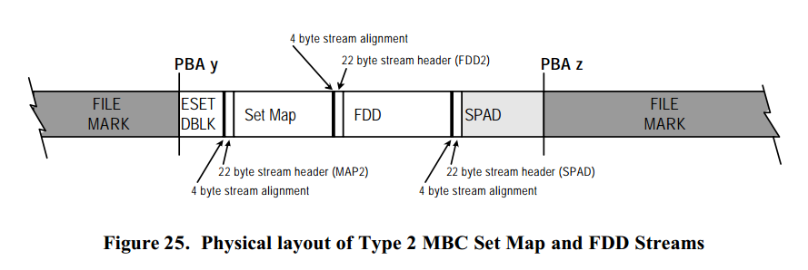
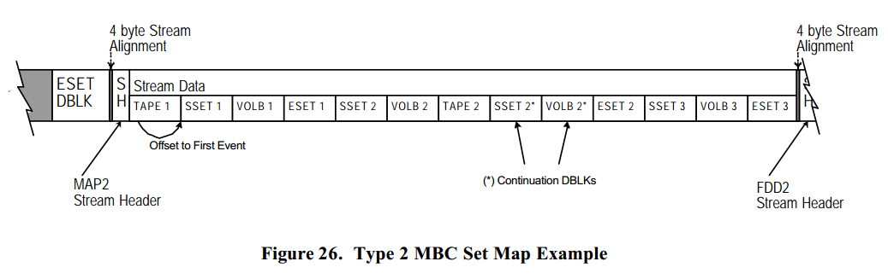
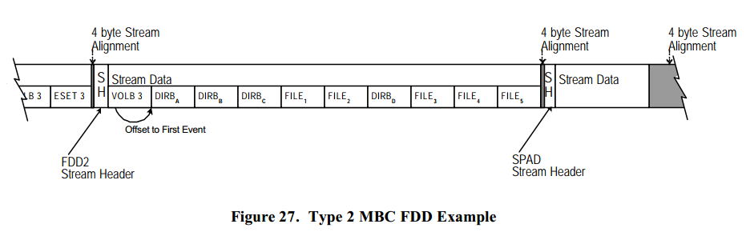
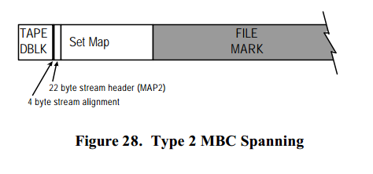

# 第二类 MBC

这部分说明了 第二类 MBC。
第二类 MBC 包含了一个 Set Map 以及 文件/目录 细节（FDD）。
所有的这些都被设计为附加在 MTF\_ESET DBLK 的末尾的定长数据流。

MAP2 与 FDD2 流头与标准的 MTF 流头一样 4 字节对齐并且后面跟着一个 SPAD 数据流填充到下一个物理块。
MTF\_ESET 的第一个为 MBC 预留的字段用于存储 MTF\_ESET 的物理块地址。

为了创建第二类 MBC，MTF\_TAPE DBLK 的基于媒介的类型 字段设置为 2 然后 MTF\_SSET DBLK 的媒介 Catalog 版本字段设置为 1。

## Set Map

Set Map 是一个流头的流 ID 字段为 'MAP2' 的流。
流头标识这个流是 第二类 MBC Set Map 随后跟着一系列的 DBLKs。
第二类 Set Map 由 MTF\_TAPE，MTF\_SSET，MTF\_VOLB 和 MTF\_ESET DBLKs 组成。
所有的 DBLKs 都是被封装的。
MTF\_DB\_HDR 的 Offset To First Event field 字段改为指向数据流中的下一个 DBLK。

## 文件/目录 细节

FDD 是一个流头的流 ID 字段为 'FDD2' 的流。
流头标这是一个第二类 MBC FDD 以及跟着一系列的 DBLKs。
第二类 FDD 由 MTF\_VOLB，MTF\_DIRB，MTF\_FILE 和 MTF\_CFIL DBLKs 组成。
所有的 DBLKs 都是被封装的。
公共头的 Reserved for MBC 和 Offset To First Event fields 字段被修改。
Reserved for MBC 标识这个 DBLKs 写到的媒介号而 Offset To First Event fields 指向 FDD 的下一个 DBLK。

## 媒体的结束问题

有可能在写 MBC 信息到媒介时出现遇到 EOM 的情况。
查看 **结束媒体的处理** 章节获取在不同情况下进行处理的详细信息。
当跨越到下一个媒介时，Set Map 如同一个关联到 MTF\_TAPE DBLK 的数据流一样。

