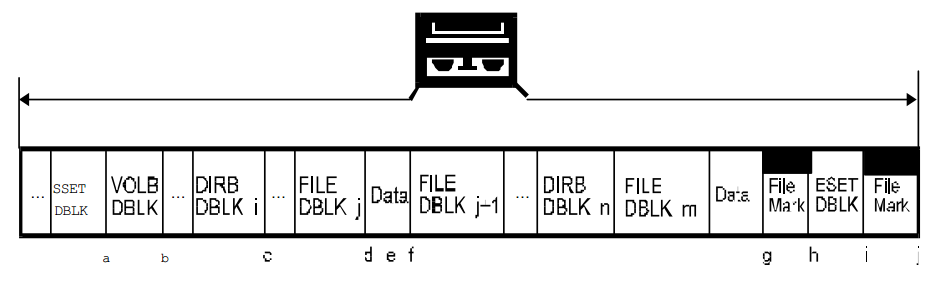
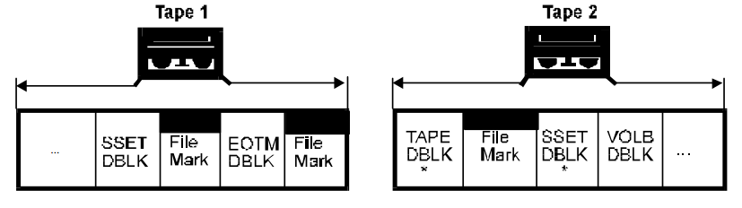
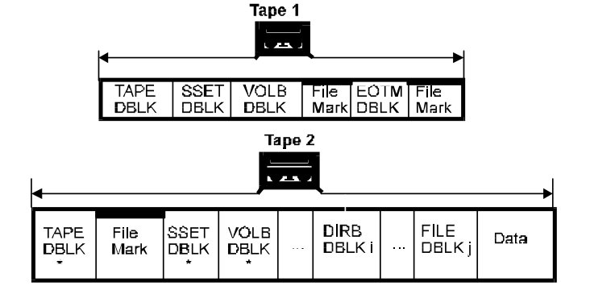
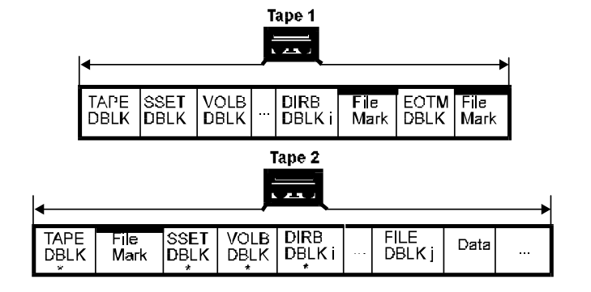
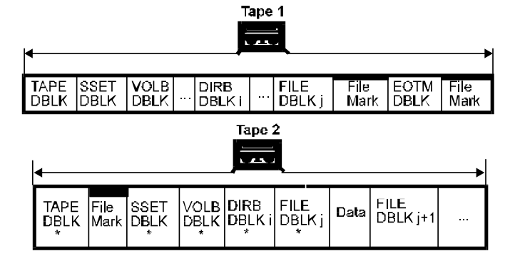
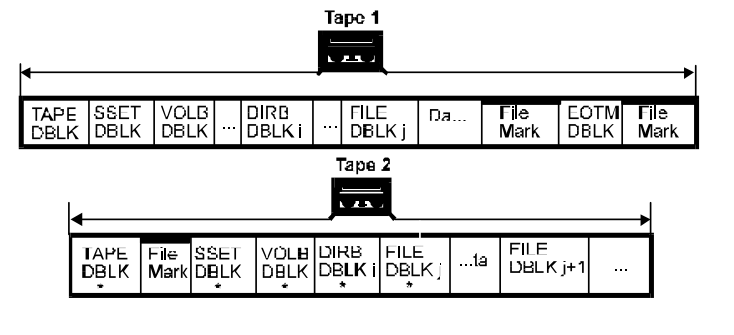
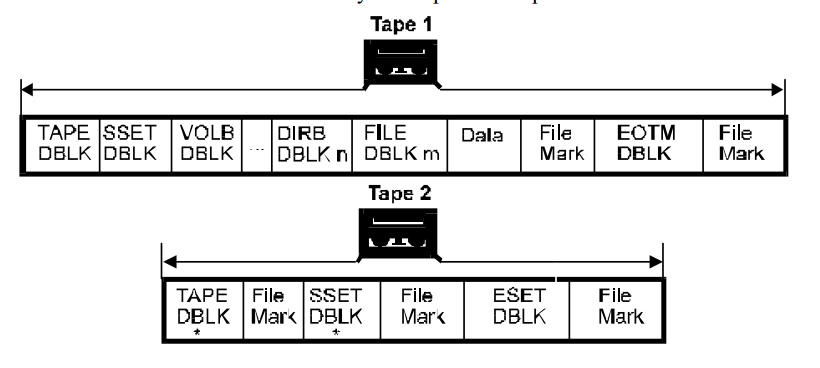
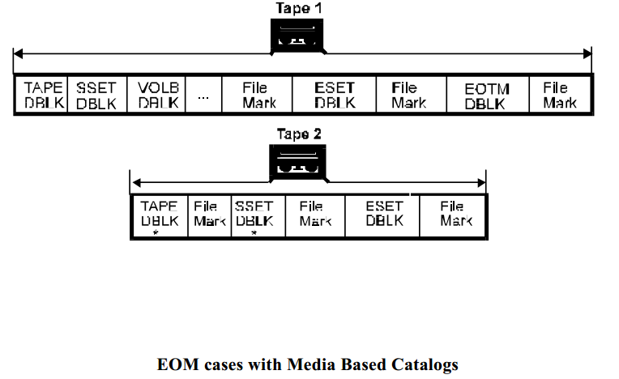
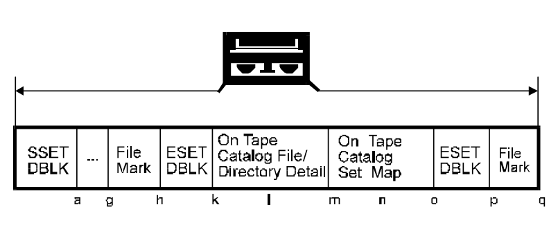

# 结束媒体处理

本节致力于 结束媒体（EOM）的处理。
下图是标识了所有 EOM 可以会出现的点的 1.0 版本的数据集格式。
接下来的是每种情况的原始和续集媒介的图以及简要的解释了如何写原始和续集媒介。

在开始详细解释各种情是怎么处理之前，有几个通用的概念需要说明。

“普通的 EOM 处理”由卷标，MTF\_EOTM 和另一个卷标组成，
然后获取续集磁带并且写入一个在属性中设置了 continuation bit set 的磁带头并且接着写入一个卷标。
在下列的情况中，任何与这个处理不一致的地方都会指出来。

下面的显示中只有 MTF\_FILE 有关联的数据，但是处理与任意的 DBLK 关联的数据的方法都是类似的。
注意到 MTF\_SSET，MTF\_VOLB 和 MTF\_DIRB 块可以在续集磁带中重复是很重要的（即使它们不是当前处理的块），在续集中需要设置  continuation 比特。
这是因为它们包含了用于从续集磁中读取和恢复数据的信息，而不用数据管理操作开始的时候的那个磁带。
然而，如果它们有任何的关联数据，这些数据不需要重复，只需要将数据的大小设置为 0。

EOM 的切分通常是发生在 FLB 边界的。
为了 EOM 处理的目的，镜像块和数据会和 MTF\_FILE 块和数据一样处理。

> 注意：在下面的所有图中，'*' 表示 DBLK 中的 MTF\_DB\_HDR 的 Block
Attributes 字段设置 MTF\_CONTINUATION 比特。

1. EOM 在 MTF\_SSET 之后 - 正常处理 EOM，在下一个媒介中重写 MTF\_SSET 并且设置 continuation 比特，然后从中断的地方继续写。

2. EOM 在 MTF\_VOLB 之后 - 正常处理 EOM，在下一个媒介中重写 MTF\_SSET 和 MTF\_VOLB 并且设置 continuation 比特，然后从中断的地方继续写。

3. EOM 在 MTF\_DIRB 之后 - 正常处理 EOM，在下一个媒介中重写 MTF\_SSET，MTF\_VOLB 和 MTF\_DIRB 并且在这三个 DBLK 中都设置 continuation 比特，然后从中断的地继续写。

4. EOM 在 MTF\_FILE 之后 - 正常处理 EOM，在下一个媒介中重写 MTF\_SSET 和 当前的 MTF\_VOLB 和 MTF\_DIRB 并且都设置 continuation 比特。
写 MTF\_FILE 并设置 continuation 比特，然后继续写 MTF\_FILE 关联的数据。
需要注意的是数据是紧跟着 MTF\_FILE 块的，而 EOM 总是出现在 FLB 的边界，EOM 出现在这里的概率非常小。

5. EOM 在 MTF\_FILE 数据的中间 - 和第四种情况一样处理 EOM。
因为数据会在 FLB 边界被分割，而数据结尾的填充数据也会填充到下一个 FLB 边界，the remaining data is written beginning at the next Format Logical Block boundary, rather than flush against the end of the continuation MTF_FILE block.

6. EOM 在 MTF\_FILE 数据的结尾 - 与 MTF\_SSET，MTF\_VOLB 和 MTF\_DIRB 不一样，如果数据已经写完，MTF\_FILE 块的信息不需要保存在续集磁带。
因此，写一个续集的 MTF\_FILE DBLK 是可选的，而续集处理与第三种情况一样。
i.e. The continuation DBLKs are written, and then the write operation continues with the block that was due to be written when EOM occurred.
7. EOM 在 数据集数据的结尾 - 在这种情况下，所有数据已经保存在磁带中，但是 MTF\_EOTM 需要写入来表示数据集延续到下一个磁带。
注意如果第一个卷标已经写入，我们不需要写入另一个。
只需要在结束数据集之前写入续集的 MTF\_SSET，但是它必须要用一个比特来表示这个数据集的数据完全包含在前一个磁带中。

8. EOM 出现在数据集之间 - 在这种情况下 MTF\_SSET 已经写入，并且数据集是完整的，但是我们不想要在这个磁带中开始另一个数据集。
因此，我们在本来应该出现下一个 MTF\_SSET 的地方写入 MTF\_EOTM，然后跟着一个 卷标。
续集磁带的写入与第七种情况相同。
This is done to guarantee the existence of a unique continuation tape for beginning the next set.
Note that while a MTF_TAPE DBLK alone is sufficient to mark a unique continuation tape, information such as the number of the last
Data Set is necessary to append to the Media Family without requesting the previous tape.

The following diagram is an example of an MTF Version 1.00a format Data Set with Media Based Catalogs (MBC) showing
marks at all unique points at which EOM early warning may be detected. This is followed by diagrams and brief explanations
of what is written on the original and continuation tapes is each case. Note that the MBC lies between the two filemarks at the
end of the set, and all EOM cases outside of MBC are handled in the same manner as with tapes which do not have MBC as
specified above. Cases a, g, and h are shown below to relate this diagram to the non-MBC diagram above. Cases k - q are
specific to MBC and detailed below.

There are some further general concepts which need to be explained before detailing the MBC cases.
In all cases, the MTF_EOTM will contain the physical block address of the second MTF_ESET of the last set which finished
completely (including MBC) on the tape. Attribute bits will be defined to indicate whether the address field is invalid (not
supported by drive or no MBC on tape), and to indicate if no ending MTF_ESET exists on the tape (i.e. one set spans the entire
tape).
What will be referred to as "normal EOM processing" for MBC cases consists of writing a filemark, an End Of Tape Marker
(MTF_EOTM) block and another filemark, getting a continuation tape and writing a tape header with the continuation bit set in
its attribute field followed by a filemark, then writing the MTF_SSET with continuation bit set, another filemark, and finally
the starting MTF_ESET with continuation bit set. Any exceptions to this process will be noted in the detail for that case.
File/Directory Data will be referred to as FDD, and the Set Map as SM.
9. EOM 在第一个 MTF\_ESET 后面 - 正常处理 EOM，然后写入 FDD。
10. EOM 在 FDD 中间 - 正常处理 EOM，然后继续写入 FDD。
11. EOM 在 FDD 后面 - 正常处理 EOM，然后开始写入 SM。
12. EOM 在 Set Map 中间 - 正常处理 EOM。
Set Map 从开头重新写。Set Map 永远不会分割在不同磁带中！
13. EOM 在 Set Map 之后 - 这种情况与第十三种情况一样处理。
这样做的目的是使得 Set Map 总在 Media Family 的最后一个磁带有效。
这使得 MBC 的处理更加清晰，免除了用户在不同磁带中进行切换来搜索 Media Family 中最后一个 Set Map 的情况。
14. EOM 在数据集之间 - 如第八种情况，在遇到 EOM 之前已经写了 MTF\_ESET，数据集已经完成。
所以我们在下一个 MTF\_SSET 预期出现的地方写入 MTF\_EOTM，然后跟着一个卷标。
然而，我们仍然需要拷贝上一个磁带的 Set Map。
因此，我们像第十三种情况一样写续集磁带。
